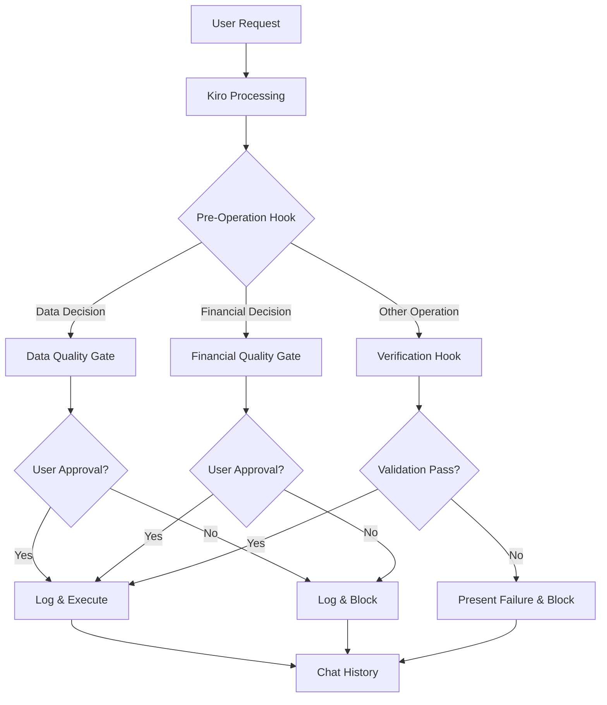

# Design Document: Reasoning Context Framework

## Overview

The Reasoning Context Framework is a configuration pattern that leverages Kiro's existing features (steering files, hooks, and chat history) to create a hierarchical context management system for life activities. Rather than building new infrastructure, this design composes existing Kiro capabilities into a structured approach for managing household tasks, organizational roles, projects, and critical decisions.

The framework addresses three core challenges:

1. **Context Management**: Organizing information across multiple life domains (household, non-profit leadership, projects) in a way that provides Kiro with the right context at the right time
2. **Quality Gates**: Ensuring critical decisions (data operations, financial impacts) receive appropriate review before execution
3. **AI Risk Mitigation**: Defending against AI drift, hallucination, and reasoning errors through verification hooks and baseline tracking

The design uses a five-layer hierarchy of steering files (framework, household, role, project, task) with cross-references to compose context. Quality gate hooks intercept operations before execution, and verification hooks validate outputs against baseline patterns and reference knowledge.

## Architecture

### Context Layer Hierarchy

The framework organizes steering files into five layers, each serving a distinct purpose:

```
.kiro/steering/
├── framework/              # Stable reference knowledge (manuals, standards, procedures)
│   ├── {domain-name}/
│   │   └── *.md
├── household/              # Household member info, schedules, preferences
│   └── context.md
├── roles/                  # Role-specific responsibilities and constraints
│   └── {role-name}/
│       └── context.md
├── projects/               # Project goals, stakeholders, timelines
│   └── {project-name}/
│       └── context.md
└── tasks/                  # Task objectives and success criteria
    └── {task-name}/
        └── context.md
```

**Layer Relationships**:
- Framework steering files are referenceable from any other layer
- Household steering is referenceable from roles, projects, and tasks
- Role steering is referenceable from projects and tasks
- Project steering is referenceable from tasks
- Task steering is the leaf layer (no references to it from other layers)

**Context Composition**: When working on a task, the user activates the task steering file, which references its parent project/role/household steering files, which may reference framework steering files. Kiro receives the composed context from all referenced files.

### Hook Architecture

The framework uses Kiro hooks at three integration points:

1. **Pre-Operation Hooks**: Execute before file operations, command execution, or recommendations
2. **Quality Gate Hooks**: Review data and financial decisions, requiring user approval for high-impact operations
3. **Verification Hooks**: Validate outputs against baseline patterns, framework references, and reasoning criteria



### Logging Architecture

The framework uses three logging mechanisms:

1. **Chat History**: Kiro's native conversation logs serve as the primary reasoning log
2. **Hook Logs**: Structured logs in .kiro/logs/ for quality gates, drift detection, hallucination flags, reasoning reviews, and framework compliance
3. **Session Exports**: Important chat sessions exported to .kiro/logs/sessions/ for long-term retention

Log files:
- `.kiro/logs/data-decisions.md`: Data operation proposals and approvals
- `.kiro/logs/financial-decisions.md`: Financial decision proposals and approvals
- `.kiro/logs/ai-drift.md`: Detected deviations from baseline behavior
- `.kiro/logs/hallucination-flags.md`: Unsupported factual claims
- `.kiro/logs/reasoning-reviews.md`: Structured review results
- `.kiro/logs/framework-compliance.md`: Reasoning framework adherence tracking

## Components and Interfaces

### Steering File Components

#### Framework Steering Files

**Purpose**: Store stable, reusable reference knowledge that doesn't change frequently.

**Location**: `.kiro/steering/framework/{domain-name}/`

**Content Examples**:
- Automotive repair manuals and service bulletins
- Organizational bylaws and procedures
- Legal regulations and compliance standards
- AI behavior baseline patterns
- Reasoning review processes
- Reasoning framework methodologies

**Interface**: Markdown files with structured sections. Referenced from other steering files using relative paths.

**Example Structure**:
```markdown
# {Domain Name} Reference

## Overview
[Description of the domain and reference material]

## Reference Content
[Stable knowledge: procedures, standards, specifications]

## Usage Guidelines
[When and how to apply this reference knowledge]
```

#### Household Steering File

**Purpose**: Maintain household context including member information, schedules, preferences, and constraints.

**Location**: `.kiro/steering/household/context.md`

**Content**:
- Household member names, ages, roles
- Schedules and availability patterns
- Preferences and constraints
- Household resources and limitations

**Interface**: Single markdown file, version-controlled. Referenced from role, project, and task steering files.

#### Role Steering Files

**Purpose**: Define role-specific responsibilities, relationships, decision authority, and constraints.

**Location**: `.kiro/steering/roles/{role-name}/context.md`

**Content**:
- Role title and scope
- Key responsibilities
- Decision-making authority and limits
- Important relationships and stakeholders
- Reference to household context (if relevant)

**Interface**: Markdown file per role. References household steering file where household context matters.

#### Project Steering Files

**Purpose**: Track project-specific goals, stakeholders, timelines, and constraints.

**Location**: `.kiro/steering/projects/{project-name}/context.md`

**Content**:
- Project goals and success criteria
- Stakeholders and their interests
- Timeline and milestones
- Constraints and dependencies
- Reference to associated role or household steering

**Interface**: Markdown file per project. References parent role or household steering file.

#### Task Steering Files

**Purpose**: Define task objectives, success criteria, and constraints with full context composition.

**Location**: `.kiro/steering/tasks/{task-name}/context.md`

**Content**:
- Task objectives
- Success criteria
- Constraints and requirements
- References to parent project/role/household steering
- References to relevant framework steering files

**Interface**: Markdown file per task. References parent steering files to compose complete context.

### Hook Components

#### Quality Gate Hook: Data Decisions

**Purpose**: Review and approve data operations that affect integrity, privacy, or persistence.

**Trigger**: Before file deletion, modification of sensitive data, or bulk data operations.

**Behavior**:
1. Detect data decision operations
2. Classify impact (deletion, modification, sensitive data)
3. Present summary to user
4. Require explicit approval for high-impact operations
5. Log decision and outcome to `.kiro/logs/data-decisions.md`
6. Block execution if rejected

**Configuration**: Hook definition in Kiro's hook configuration file, specifying trigger patterns and approval thresholds.

**Log Entry Format**:
```markdown
## [Timestamp] Data Decision

**Operation**: [Description]
**Impact**: [Deletion/Modification/Sensitive]
**Active Steering Files**: [List of active context files]
**Rationale**: [Kiro's reasoning]
**User Decision**: [Approved/Rejected]
**Rejection Reason**: [If rejected]
```

#### Quality Gate Hook: Financial Decisions

**Purpose**: Review and approve decisions with monetary implications.

**Trigger**: Before operations involving purchases, payments, resource allocation, or financial commitments.

**Behavior**:
1. Detect financial decision operations
2. Calculate monetary impact
3. Compare against configured thresholds
4. Present summary to user if threshold exceeded
5. Require explicit approval for high-impact decisions
6. Log decision and outcome to `.kiro/logs/financial-decisions.md`
7. Block execution if rejected

**Configuration**: Hook definition with monetary thresholds in configuration file.

**Threshold Configuration Example**:
```json
{
  "financial_thresholds": {
    "auto_approve_max": 50,
    "require_review_min": 50,
    "currency": "USD"
  }
}
```

#### Verification Hook: AI Drift Detection

**Purpose**: Detect deviations from baseline AI behavior patterns.

**Trigger**: After Kiro generates outputs, before presenting to user.

**Behavior**:
1. Load baseline behavior patterns from `.kiro/steering/framework/ai-behavior-baseline/`
2. Compare current output characteristics against baseline
3. Calculate deviation score
4. Log significant deviations to `.kiro/logs/ai-drift.md`
5. Continue execution (non-blocking)

**Baseline Patterns**: Framework steering file documenting expected response characteristics, reasoning patterns, and output formats.

**Log Entry Format**:
```markdown
## [Timestamp] AI Drift Detected

**Context**: [Active steering files]
**Deviation Type**: [Response length/Reasoning pattern/Output format]
**Deviation Score**: [Numeric measure]
**Expected Pattern**: [From baseline]
**Observed Pattern**: [Current behavior]
```

#### Verification Hook: Hallucination Detection

**Purpose**: Validate factual claims against steering file content and require citations.

**Trigger**: After Kiro generates outputs containing factual claims.

**Behavior**:
1. Parse output for factual claims
2. Validate claims against active steering files and framework references
3. Flag unsupported claims
4. Require user confirmation for flagged outputs
5. Log potential hallucinations to `.kiro/logs/hallucination-flags.md`
6. Block execution if user rejects flagged output

**Citation Requirements**: For data and financial decisions, require explicit citations to steering file sections.

**Log Entry Format**:
```markdown
## [Timestamp] Hallucination Flag

**Claim**: [Factual statement]
**Context**: [Active steering files]
**Validation Result**: [Supported/Unsupported/Inference]
**User Action**: [Confirmed/Rejected/Updated Steering]
```

#### Verification Hook: Reasoning Review

**Purpose**: Apply structured review criteria to validate AI outputs systematically.

**Trigger**: Before executing operations, especially for data and financial decisions.

**Behavior**:
1. Load review criteria from `.kiro/steering/framework/reasoning-review-process/`
2. Apply criteria: factual accuracy, logical consistency, completeness, context alignment
3. Calculate scores for each criterion
4. Determine pass/fail status
5. Log results to `.kiro/logs/reasoning-reviews.md`
6. Present failure reasons if validation fails
7. Block execution on failure

**Review Criteria Structure**:
- Factual Accuracy: Claims supported by steering files or marked as inference
- Logical Consistency: No contradictions in reasoning chain
- Completeness: All required information present
- Context Alignment: Output aligns with active steering file constraints

**Domain-Specific Criteria**: Framework steering files can define additional criteria for specialized contexts (e.g., automotive diagnostics must include error code lookup).

#### Verification Hook: Reasoning Framework Compliance

**Purpose**: Ensure AI analysis follows documented methodologies and patterns.

**Trigger**: When reasoning framework is referenced in active steering files.

**Behavior**:
1. Identify active reasoning frameworks from task/project steering references
2. Load framework structure from `.kiro/steering/framework/reasoning-patterns/`
3. Validate output follows framework steps and structure
4. Log compliance status to `.kiro/logs/framework-compliance.md`
5. Flag non-compliance to user

**Framework Examples**:
- Root cause analysis (5 Whys, Fishbone)
- Decision trees
- Risk assessment matrices
- Troubleshooting procedures (automotive diagnostics)
- Financial planning methodologies

### Documentation Components

#### Steering README

**Purpose**: Document context composition patterns, hierarchy, and usage guidelines.

**Location**: `.kiro/steering/README.md`

**Content**:
- Directory structure explanation
- Context layer hierarchy and relationships
- Context composition patterns for common scenarios
- Guidance on creating vs. updating steering files
- Framework steering usage guidelines
- Naming conventions
- Example references

#### Hook Configuration

**Purpose**: Define hook integration points, triggers, and behavior.

**Location**: Kiro's hook configuration file (implementation-specific)

**Content**:
- Hook definitions for quality gates and verification
- Trigger patterns and conditions
- Threshold configurations
- Timeout values
- Log file paths

## Data Models

### Steering File Reference Model

Steering files reference each other using relative paths to compose context:

```markdown
# Task: Replace Car Battery

## Context References

- Project: [[../projects/car-maintenance/context.md]]
- Household: [[../household/context.md]]
- Framework: [[../framework/automotive/battery-replacement-procedure.md]]

## Task Details
[Task-specific content]
```

**Reference Resolution**: When a task steering file is activated, Kiro loads all referenced files recursively (following the hierarchy) to build complete context.

**Circular Reference Prevention**: References only flow down the hierarchy (framework can't reference other layers, household can't reference roles/projects/tasks, etc.).

### Log Entry Model

All hook logs follow a consistent structure:

```markdown
## [ISO 8601 Timestamp] [Log Type]

**Context**: [Active steering files at time of log]
**[Type-Specific Fields]**: [Values]
**Outcome**: [Result]
```

**Timestamp Format**: ISO 8601 (YYYY-MM-DDTHH:MM:SSZ)

**Context Field**: List of all active steering files, enabling correlation between logs and context state.

### Hook Configuration Model

Hooks are configured with:

```json
{
  "hook_name": "data-decision-quality-gate",
  "trigger": "before_file_operation",
  "conditions": ["operation_type in ['delete', 'modify']", "file_contains_sensitive_data"],
  "action": "require_user_approval",
  "log_path": ".kiro/logs/data-decisions.md",
  "timeout_seconds": 30
}
```

**Fields**:
- `hook_name`: Unique identifier
- `trigger`: Lifecycle event (before_file_operation, before_command, after_output_generation)
- `conditions`: List of conditions that must be met for hook to execute
- `action`: Hook behavior (require_user_approval, log_only, block_on_failure)
- `log_path`: Where to write log entries
- `timeout_seconds`: Maximum execution time before hook is bypassed

### Baseline Behavior Model

AI behavior baselines are documented in framework steering files:

```markdown
# AI Behavior Baseline

## Response Characteristics

- **Average Response Length**: 200-500 words for standard queries
- **Code Block Usage**: Present in 80% of technical responses
- **Citation Frequency**: At least one reference per factual claim

## Reasoning Patterns

- **Step-by-Step Analysis**: Multi-step problems broken into numbered steps
- **Assumption Statements**: Explicit statement of assumptions before conclusions
- **Alternative Consideration**: At least two alternatives considered for decisions

## Output Formats

- **File Paths**: Always use relative paths from workspace root
- **Command Syntax**: Include full command with all required flags
- **Error Messages**: Include error code and suggested resolution
```

**Deviation Detection**: Verification hook compares current outputs against these documented patterns and flags significant deviations.


## Correctness Properties

A property is a characteristic or behavior that should hold true across all valid executions of a system—essentially, a formal statement about what the system should do. Properties serve as the bridge between human-readable specifications and machine-verifiable correctness guarantees.

### Property 1: Hierarchical Reference Resolution

For any two steering files where the hierarchy allows references (framework referenceable from any layer, household referenceable from role/project/task, role referenceable from project/task, project referenceable from task), creating a reference using relative paths should resolve correctly and load the referenced content.

**Validates: Requirements 1.4, 2.4, 3.4, 4.3, 4.4, 5.3**

### Property 2: Relative Path References

For any reference between steering files, the reference path should be relative (not absolute), enabling portability of the steering file structure.

**Validates: Requirements 6.4**

### Property 3: Circular Reference Detection

For any set of steering files with references, there should be no circular reference chains (A→B→C→A). The reference graph should be acyclic.

**Validates: Requirements 7.4**

### Property 4: Hook Log Entry Completeness

For any hook execution (quality gate, verification, or logging hook), the resulting log entry should contain a timestamp in ISO 8601 format, a list of active steering files at execution time, and all type-specific required fields (e.g., decision details for quality gates, deviation description for drift detection, criteria scores for reasoning reviews).

**Validates: Requirements 8.3, 8.4, 14.3, 14.4, 15.4, 16.5, 17.5**

### Property 5: Data Decision Approval and Blocking

For any data decision operation (deletion or modification of data), the quality gate hook should require explicit user approval before execution, and if the user rejects the decision, the hook should block execution and log the rejection reason.

**Validates: Requirements 9.2, 9.5**

### Property 6: Sensitive Data Privacy Marking

For any data decision involving sensitive information, the quality gate hook should flag the operation with privacy markers in the log entry.

**Validates: Requirements 9.3**

### Property 7: Data Decision Impact Summary

For any data decision operation, the quality gate hook should generate and present a summary of data impact before requesting user approval.

**Validates: Requirements 9.4**

### Property 8: Financial Decision Threshold Approval

For any financial decision with monetary impact exceeding the configured threshold, the quality gate hook should require explicit user approval, and if the user rejects the decision, the hook should block execution and log the rejection reason.

**Validates: Requirements 10.3, 10.5**

### Property 9: Financial Decision Impact Summary

For any financial decision operation, the quality gate hook should generate and present a summary of financial impact (including monetary amount) before requesting user approval.

**Validates: Requirements 10.4**

### Property 10: Factual Claim Validation

For any factual claim in Kiro's output, the verification hook should validate that the claim is either supported by content in active steering files or explicitly marked as inference/assumption.

**Validates: Requirements 15.2**

### Property 11: Reasoning Review Criteria Validation

For any reasoning review execution, the verification hook should validate the output against all four criteria: factual accuracy, logical consistency, completeness, and alignment with steering file context.

**Validates: Requirements 16.3**

### Property 12: Validation Failure Blocking

For any verification hook that fails validation (unsupported factual claims, failed reasoning review, or framework non-compliance), the hook should block the operation, present the specific failure reasons to the user, and require user confirmation or correction before proceeding.

**Validates: Requirements 15.3, 16.4, 18.4**

### Property 13: Reasoning Framework Compliance Validation

For any active reasoning framework (referenced in task or project steering files), the verification hook should validate that Kiro's output follows the framework's documented structure and steps.

**Validates: Requirements 17.4**

## Error Handling

### Steering File Reference Errors

**Missing Reference Target**: If a steering file references a non-existent file, the system should present a clear error message indicating which file is missing and which steering file contains the broken reference. The user should be prompted to either create the missing file or remove the reference.

**Circular Reference Detection**: If the system detects a circular reference chain during context loading, it should halt the loading process, present the complete reference chain to the user, and request that the user refactor the steering files to break the cycle.

**Invalid Reference Path**: If a reference path is malformed or uses absolute paths instead of relative paths, the system should warn the user and suggest the correct relative path format.

### Hook Execution Errors

**Hook Timeout**: If a hook execution exceeds the configured timeout value, the system should log a timeout warning, bypass the hook to prevent blocking the user, and notify the user that validation was skipped due to timeout.

**Hook Configuration Error**: If a hook is misconfigured (missing required fields, invalid trigger patterns, or inaccessible log paths), the system should fail gracefully at startup, present the configuration error details, and disable the problematic hook until corrected.

**Log Write Failure**: If a hook cannot write to its configured log file (permissions issue, disk full, or invalid path), the hook should continue execution but notify the user of the logging failure and suggest corrective actions.

### Verification Hook Errors

**Baseline Missing**: If the AI drift detection hook cannot find the baseline behavior file, it should log a warning and skip drift detection for that execution rather than blocking the user.

**Framework Reference Missing**: If a task references a reasoning framework that doesn't exist, the verification hook should notify the user of the missing framework and ask whether to proceed without framework validation or halt until the framework is created.

**Validation Criteria Undefined**: If a reasoning review hook cannot find the review criteria file, it should notify the user and ask whether to proceed without review or halt until criteria are defined.

### Quality Gate Errors

**User Approval Timeout**: If a quality gate hook requests user approval but receives no response within a reasonable timeout (e.g., 5 minutes), the system should default to blocking the operation and log the timeout event.

**Threshold Configuration Missing**: If a financial decision hook cannot find threshold configuration, it should default to requiring approval for all financial decisions and notify the user of the missing configuration.

**Impact Summary Generation Failure**: If a quality gate hook cannot generate an impact summary (due to insufficient context or parsing errors), it should present a generic warning to the user and still require approval for the operation.

## Testing Strategy

### Dual Testing Approach

This feature requires both unit testing and property-based testing to ensure comprehensive coverage:

**Unit Tests** focus on:
- Specific examples of steering file references and context composition
- Edge cases like empty steering files, malformed references, and missing files
- Integration between hooks and log files
- Specific hook configurations and threshold values
- Error conditions and failure modes

**Property-Based Tests** focus on:
- Universal properties that hold across all steering file configurations
- Reference resolution across all valid hierarchy combinations
- Hook behavior across all decision types and approval scenarios
- Log entry completeness across all hook types
- Validation behavior across all input variations

Together, unit tests catch concrete bugs in specific scenarios, while property tests verify general correctness across the entire input space.

### Property-Based Testing Configuration

**Testing Library**: For this configuration-based feature, property-based testing will focus on validating the behavior of any hooks or scripts that implement the verification logic. The specific library depends on the implementation language:
- Python: Hypothesis
- JavaScript/TypeScript: fast-check
- Other languages: Use the standard property-based testing library for that ecosystem

**Test Configuration**:
- Minimum 100 iterations per property test (due to randomization)
- Each property test must include a comment tag referencing the design document property
- Tag format: `# Feature: reasoning-context-framework, Property {number}: {property_text}`

**Property Test Implementation**:
- Property 1 (Hierarchical Reference Resolution): Generate random steering file structures with valid references, verify all references resolve correctly
- Property 2 (Relative Path References): Generate random references, verify none use absolute paths
- Property 3 (Circular Reference Detection): Generate random reference graphs including some with cycles, verify cycles are detected
- Property 4 (Hook Log Entry Completeness): Generate random hook executions, verify all log entries contain required fields
- Property 5-9 (Quality Gate Properties): Generate random decision operations, verify approval/blocking/logging behavior
- Property 10-13 (Verification Properties): Generate random outputs with varying validation states, verify correct validation and blocking behavior

### Unit Testing Focus

Unit tests should cover:

**Steering File Reference Examples**:
- Task referencing project, project referencing role, role referencing household
- Task referencing framework files directly
- Multiple framework files referenced from a single task
- Empty steering files (valid but contain no content)
- Steering files with only references (no local content)

**Hook Integration Examples**:
- Data decision hook detecting file deletion operation
- Financial decision hook with amount exactly at threshold boundary
- Drift detection hook with baseline file present
- Hallucination detection hook with mixed supported/unsupported claims
- Reasoning review hook with partial criteria failures

**Error Condition Examples**:
- Missing reference target file
- Circular reference: A→B→A
- Hook timeout during long validation
- Log file write permission denied
- Missing baseline or framework file

**Edge Cases**:
- Steering file with 0 bytes (empty)
- Reference path with unusual but valid characters
- Financial decision with $0 amount
- Hook execution with no active steering files
- Validation with empty baseline patterns

### Testing the Configuration Pattern

Since this feature is primarily a configuration pattern rather than executable code, testing focuses on:

1. **Documentation Testing**: Verify that the README and documentation examples are accurate and complete
2. **Template Testing**: Verify that template steering files contain all required sections
3. **Hook Script Testing**: If hooks are implemented as scripts, test the scripts with property-based and unit tests
4. **Integration Testing**: Manually test the complete workflow (create steering files, activate context, trigger hooks, review logs)
5. **Validation Script Testing**: If validation scripts are created for circular reference detection or reference resolution, test them thoroughly

### Manual Testing Scenarios

The following scenarios should be manually tested to verify the complete system:

1. **Context Composition**: Create a task steering file that references project, role, household, and framework files. Activate the task and verify Kiro has access to all context.
2. **Data Decision Quality Gate**: Trigger a file deletion operation and verify the hook requests approval, logs the decision, and blocks execution if rejected.
3. **Financial Decision Quality Gate**: Trigger a financial operation above and below the threshold, verify approval is only required above threshold.
4. **Drift Detection**: Generate outputs that deviate from baseline patterns and verify drift is logged.
5. **Hallucination Detection**: Make unsupported factual claims and verify they are flagged and require confirmation.
6. **Reasoning Review**: Submit outputs that fail review criteria and verify failure reasons are presented.
7. **Framework Compliance**: Activate a reasoning framework and verify outputs are validated against framework structure.
8. **Circular Reference Detection**: Create a circular reference and verify it is detected and reported.

